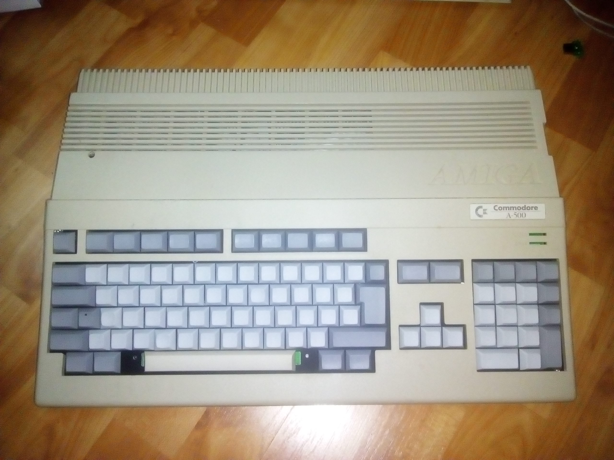
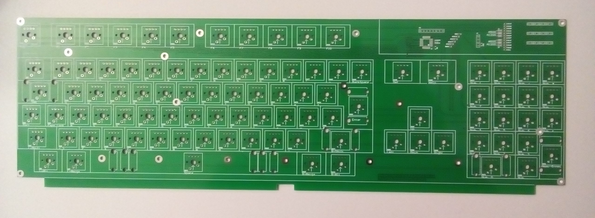
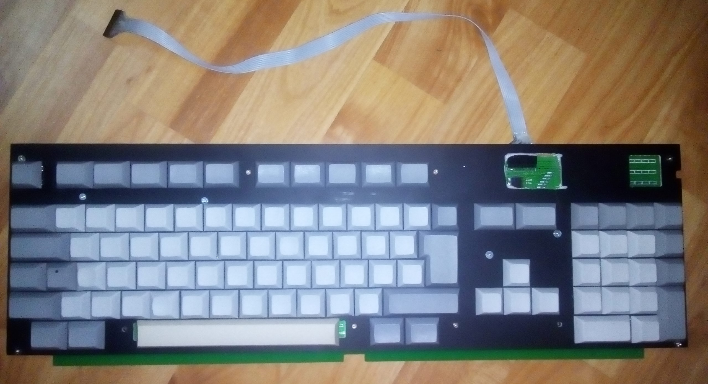
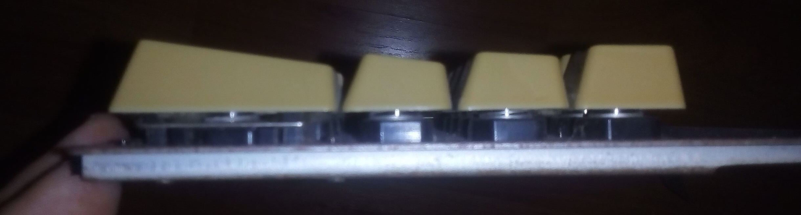
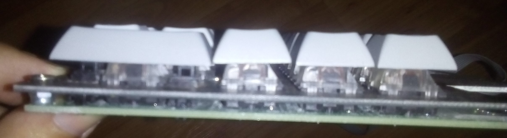

# Mechanical Replacement Keyboard for Amiga 500 and 1200

Many years ago I got an Amiga 500 with missing keyboard. Since then original keyboards became so expensive, that custom mechanical keyboards can be built for the price of an original.
Unfortunately, Amiga-style Cherry MX keycaps are unavailable, so I used DSA profile blank keycaps. As 9 unit space is rare, I used a 7 unit instead.

## How to build
First, order the PCB from your favourite manufacturer using the Gerber files in /hw/fab/. At the same time, get a 1.5 mm thick plate, paint it black, and mill out the support plate using a CNC mill. You can find the design files in DXP and Gerber format in /hw/fab/. 
After you got the PCB, populate the connector to the motherboard, and all the SMD components on the top layer. Then, using screws and nuts/washers fasten the support plate to the PCB. Don't forget to add the brackets to larger keys such as space. Only at this point you should solder the key switches. Populate the diodes at the bottom layer. And finally, using an ST-Link v2 programmer, you can burn the hex file in /fw/release/ to the microcontroller.

## Known bugs

Revision A was a failure, as the position of many keys was inaccurate. Revision B seems good so far -- maybe a little bit of fileing needed here and there, for the best fit. Also, the positions of the LEDs are not accurate for the original LEDs.

The firmware is not finished yet -- it works for most of the time, but it's not perfect.

## Tools used

* Altium Designer 2011
* IAR Embedded Workbench for STM8 1.40.1

## Some more pictures
The PCB:

Assembled (note: an additional hole was cut on the plate to debug the MCU):

Original Amiga profile keycaps:

DSA profile keycaps:

